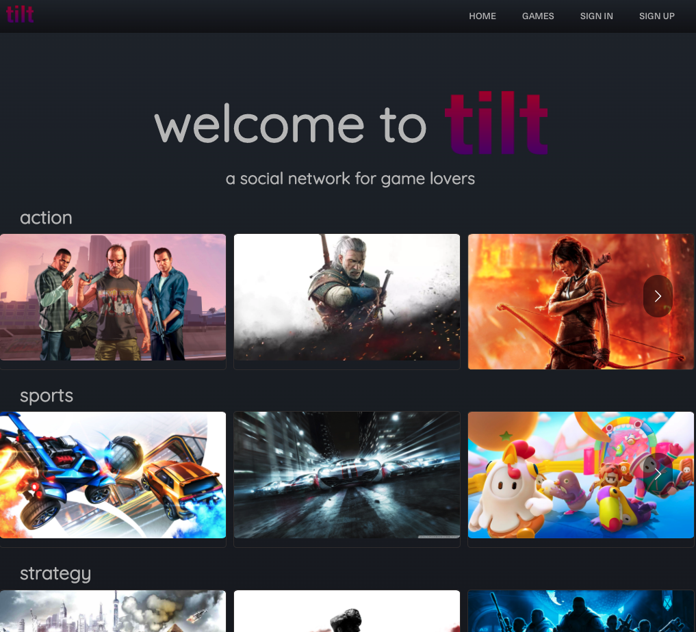
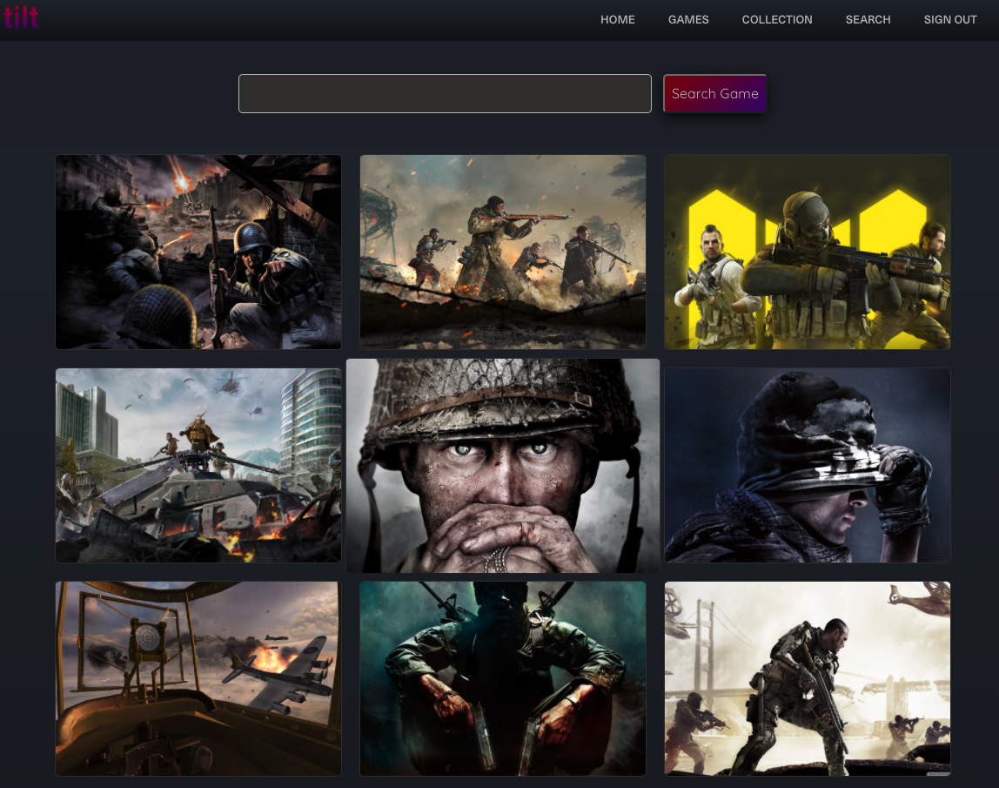
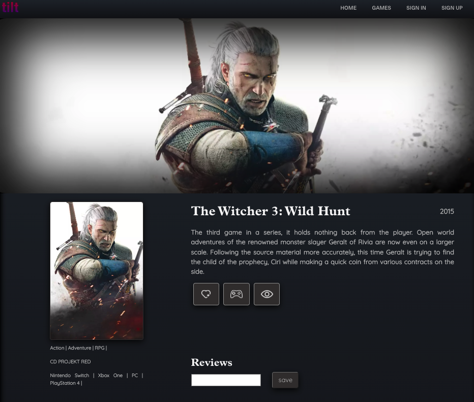
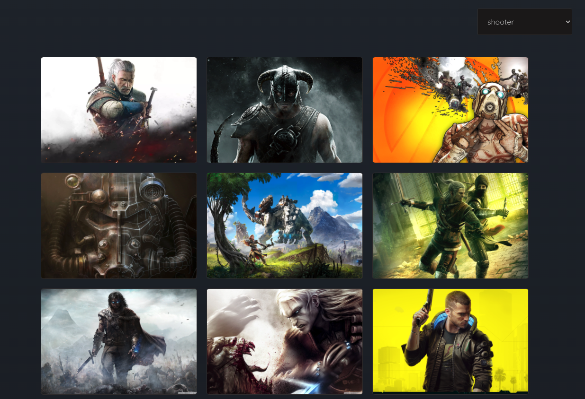
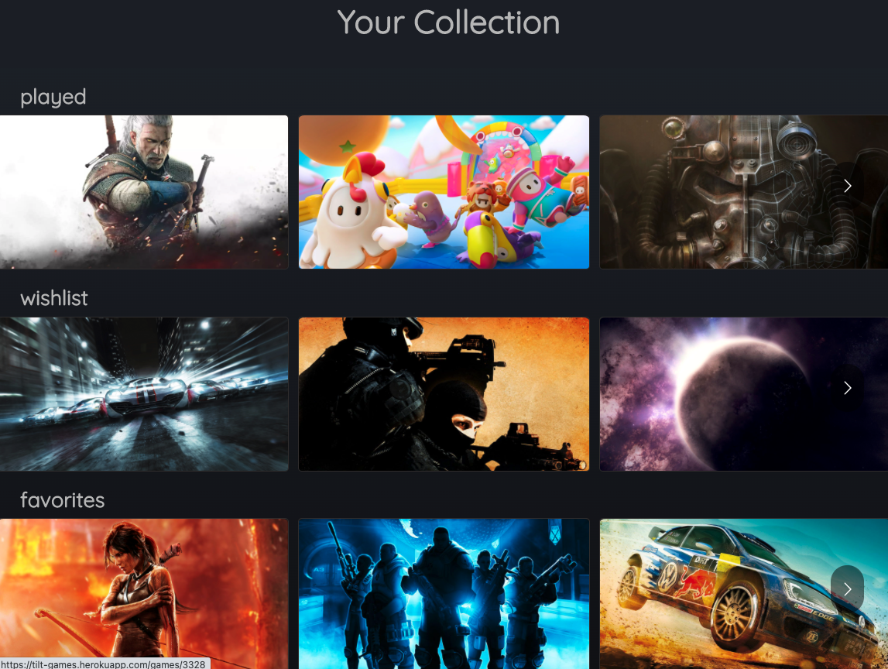
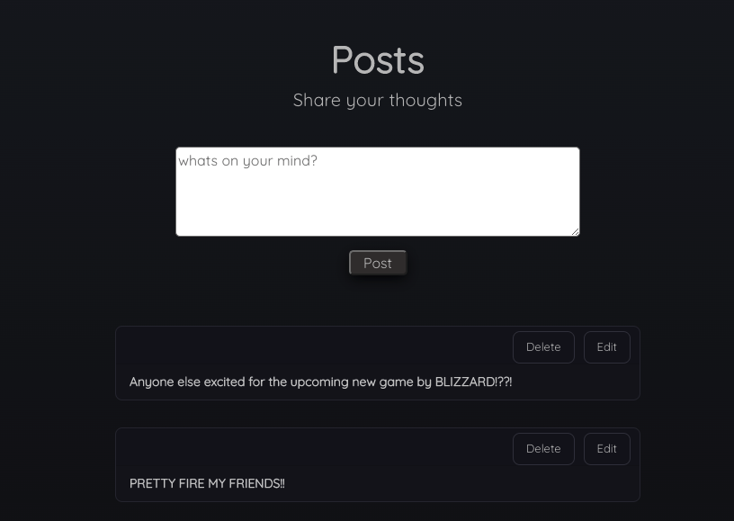

# T I L T
tilt is a social network for gamers, meant to provide a way to archive your collection of games across genres, platforms and decades. tilt allows you to search and sort through games, as well as add any game to a collection whether it be favorited, played or a wishlisted.

[t i l t](https://tilt-games.herokuapp.com)

## The website ⬇

###  Home
If a person wishes to browse through games or search for a game of their liking, they wont have to sign up!

### Search for any game!

A user has the ability to search directly for a game

 

### Details
A user can view any game's detail page

 

### Genre
A user has the ability to view any genre of their choosing

### Collection
A user has the ability to add any game while browsing to their Played/Completed/Favorited list

### Posts

Users can post on the home page, to share their thought, ideas, or anything really with all other users 

### Trello

[Planning Materials](https://trello.com/b/sCZE4iqp/unit-4-sprint-board)

### Techonologies Used

- React Native 
- Bootstrap 
- Node.js
- MongoDB
- Express 
- CSS 
- JavaScript
- Mongoose

 ## Sources and Credits

* Game data sourced from [RAWG Games API](https://rawg.io/apidocs)
* [Tilt Logo](https://mungai95.github.io/about.html) designed by Michael Mungai
* Carousel from [REACT-multi-carousel]()

  

## Next Steps

- [ ] Have usernames display with corresponding reviews/posts
- [ ] Incorporate Steam API to add the ability to be directed to purchase a title
- [ ] Display significantly more games, and potentially look into pagination
- [ ] Search bar in nav
- [ ] I want to be able to follow other users to see their reviews, posts and collected games.
